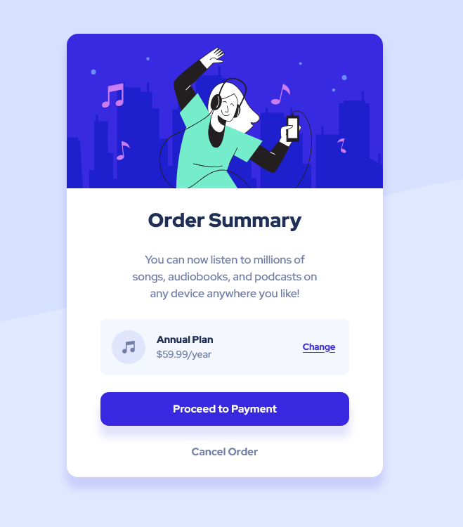

# FEM - Order Summary Card

This is a solution to the [Order summary card challenge on Frontend Mentor](https://www.frontendmentor.io/challenges/order-summary-component-QlPmajDUj).

## Table of contents

- [Overview](#overview)
  - [The challenge](#the-challenge)
  - [Screenshot](#screenshot)
  - [Links](#links)
- [My process](#my-process)
  - [Built with](#built-with)
  - [What I learned](#what-i-learned)
  - [Continued development](#continued-development)

## Overview

### The challenge

- See hover states for interactive elements
- Have a different background depending on the screensize

### Screenshot



### Links

- Solution URL: [https://github.com/chucksterv/fem-order-summary-component]
- Live Site URL: [https://order-summary.projects.deshand.com/]

## My process

### Built with

- Semantic HTML5 markup
- CSS custom properties
- Flexbox
- CSS Grid
- Mobile-first workflow
- BEM Naming conventions

### What I learned

- Learned that using using :hover with a ',' changes the hover states of all buttons instead of just the button I'm trying to target with the first element.
- Setting max-width with grid elements needs to be explored more.
- Basics of background-image property in CSS

```css
@media (min-width: 400px) {
  body {
    background-image: url(images/pattern-background-desktop.svg);
    background-size: contain;
    background-repeat: no-repeat;
  }
}
```

```css
.card__cancel-payment:focus,
.card__cancel-payment:hover {
  color: var(--clr-neutral-600);
}
```

### Continued development

- Using width property and how they connect with things such as flexbox and Grid need to be further explored.
- Need to use background images in future projects to get used to working with it.
